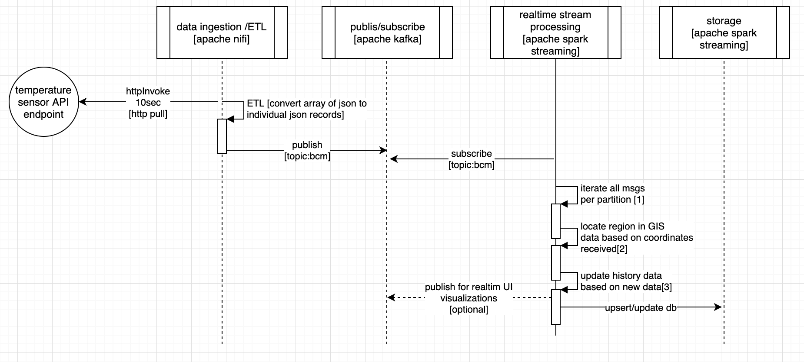
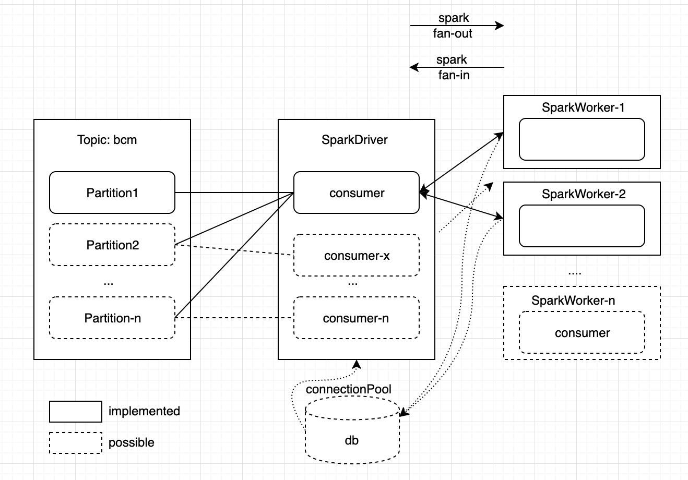
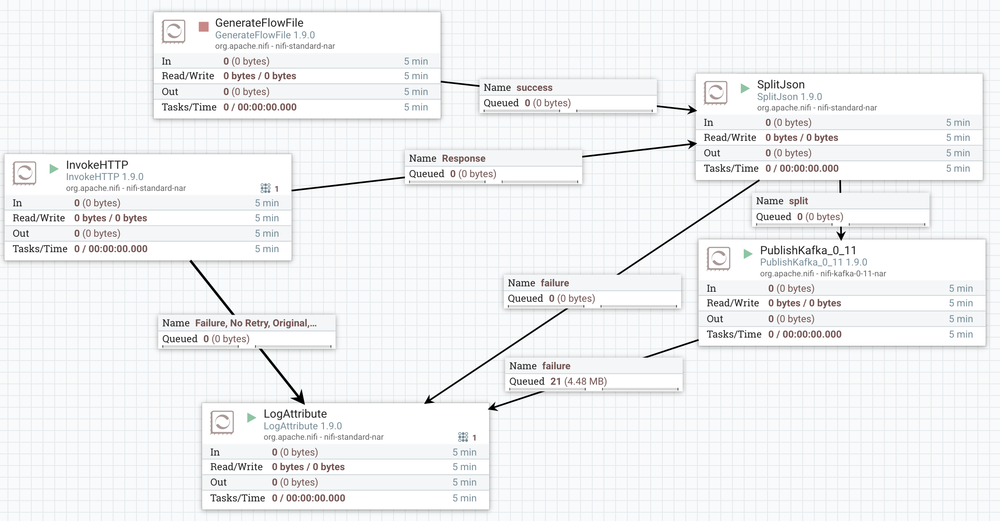
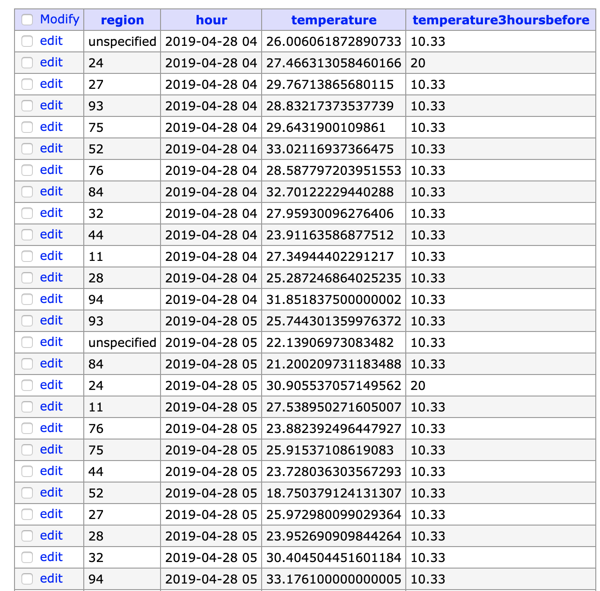
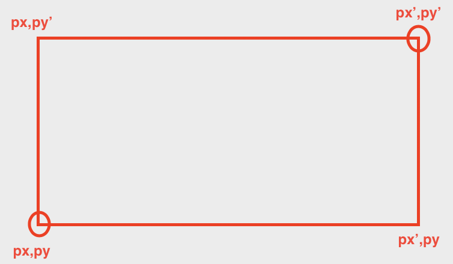
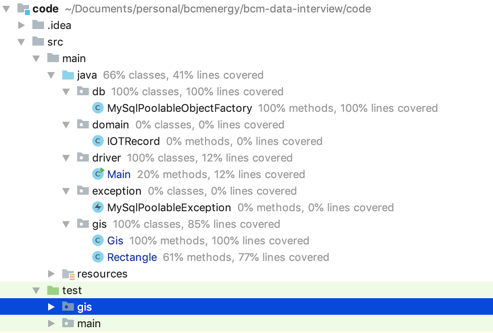

# IOT Data Usecase POC
 
## Context

***This POC serves the objective is to find out the mean temperature for every region in France segregated to per hour per region within France.*** 

This is a demonstration of an IOT use case on a data stack ready to run at scale in high availibility, fault tolerant clustered environment, comprising of
  - Apache NiFi : Data Ingestion
  - Apache Kafka : For IOT events distribution
  - Apache Spark Streaming : For realtime IOT data processing
  - MySQL : For sensor data storage [not so `bigdata` though, see Architecture Plan section for detail]
  - ...

## Solution Detail

### Data Pipeline

In this usecase, IOT data (from simulated temperature sensor) is retrieved from the API endpoint provided with an interval of 10sec (configurable), passed through ETL pipeline and published through kafka from where it is processed by Spark Streaming for computations in combincation of history data in DB and newly received for which results are consequently saved to DB (or can be pushed to another kafka queue for otehr consumers for example realtime visualizations on UI).


 

    [1] Kafka supports partitions to have the messages delivered to different consumers even under same topic - its taken care of in spark driver (consumer) [further details in next figure]
    [2] Each msg contains lat/lon i.e. location of sensor on map. Its looked for which region of France it belongs to and hourly mean is saved in database. `gis` package in code covers the algorithm used to achieve this.
    [3] FI no data saved for this hour and region is found in db, its saved now otherwise its updated with mean of hour. Its also checked with each eventy if 3 hours ago data is available and updated accordingly if its change of our

 

 Below is the API endpoint used to retrieve simulated temperature sensor data (only France data is considered that can be changed in code ofcourse)

``` 
curl -H "X-API-Key: dd764f40" https://my.api.mockaroo.com/sensor/temperatures
``` 
 
This Rest API sends back a json with the following schema:

```
[
  {
    "id": "1b16b092-e8e8-490b-a9be-0db1580fb164", // An unique id 
    "timestamp": "2019-02-19 14:02:10", // the timestamp at which the record was taken
    "lat": 45.6258385, // latitude
    "lon": 0.0629891, // longitude
    "temperature": 29.4068, // the temperature value
    "country": "France" // the country
  }
]
```

Every record contains the temperature at the moment  API is called. Below is the Flow of NiFi that fetches the data and frequency of data retrieval can be controlled through configuration.



Worth mentioning processors of nifi NiFi's (the template of flow is available in this repository as bcm-iot-flow.xml);
  - InvokeHttp processor (entry point) : triggers data fetch call to API with configurable interval and response is an array of JSON objects as mentioned above
  - SplitJson : receives array of json objects oi.e. per meter reading and transmits to kafka queue as single record flow for demonstration of how a pipeline of ETL can be created through processors of nifi
  - GenerateFlowFile : is used to generate simulated traffic when API is down. Its used to Stress Test the whole end to end data processing and helpful for hardware dimensioning

The processed analytics result is saved in database as shown in figure below averaged per hour and with each record insertion, its checked whether there exists a record 3 hours ago for the same region - if yes, its updated in db.



* SQL Command to retrieve results

```
select region as Region, temperature as MeanTemperature, temperature3hoursbefore as Temperature3HoursAgo from bcm.bcm where hour='2019-04-28 04';
```

* How Location of Point is determined?

As per requirement, the algorithm is kept very simple. The rectangle is constructed from all points defining polygon of region (see gis.Rectangle.adjust(point2d) function). Once rectangle is constructed, x and y coordinates of point are checked against following two points (check gis.Rectangle.situatedInside(x,y) function for details);




Essentially the point of interest is checked for being placed between x and x', y and y' through these two points based on rectangle based rough estimations of region.

### Code Test Coverage (**a bonus**):

Code unit test coverage is 66% but black box test is 100% thanks to technology stack used. Why unit test coverage is not >80%? Spark DStreams are distributed datastructure running at the core of framework and mostly running on Worker nodes. A lot of code restructuring would be needed to unit test the code since no proper framework (other than actual dataflow) is available for such distributed.



### How to run Application  (**a bonus**):

Considering the audience of this POC are data engineers/architects/developers; all dependencies are packaged as docker containers. A docker-compose file is packed with the deliverable in which all dependencies required to run the POC are provided;

* Step1

    git clone this repository

* Step2

    inside the dirctory; `docker-compose up -d`
    [Note that if you are running on MAC, kafkazookeeper `ADVERTISED_HOST` should be ip of your docker-machine. In case of linux you can change it to one of IPs of the machine (shall tell you someother time why :))]

* Step3

    Upload nifi template packaged with name `bcm-iot-flow.xml` can be uploaded to nifi that should be available on http://localhost:8093/nifi. Once loaded, press 'Play' button on processors (other than GenerateFlowFile) to ensure its in running state. Now the messages should be published directly to Kafka

* Step4

    Application realtime streaming code is in folder 'code' - its developed in IntelliJ so it should import flawlessly. And then run 'Main' class. Jar file can also be directly run as background worker through (1) `mvn clean package` and then `nohup java -jar target/*.jar` [note: geojson files are placed under data/*.json - currently absolute path is configure, either change it should have same directory struction]

### for each expected point (**a bonus**):

** SPOFs (if any) **

  POC in its current form is not clustered/fault tolerant. Running in high availability would require addition configuration on components but the components chosen all support clustering and active/active or active/standby configurations at each level (other than MySQL).

** Future problems **

  1. MySQL that may not be as dynamic with growing needs as some other options could be like HBase and Cassandra; particularly Cassandra for an IOT usecase being an AP database! 

  2. Currently POC is configured to run on `sparkMaster("local[*]")` mode securing maximum available CPUs to spark both for driver and worker nodes. If the spark cluster is configured (2.4.0); the commented line in code `driver.Main` can be uncommented to directly launch on server.

** Budget **

  Budget for hardware would depend on end to end traffic model. For instance the only thing not variable (to some extent) for the moment is size of response received from API end point that is known and I can give small demonstration of data transfer calculation based on that external and internal communication bandwidth can be estimated;

  - 220KB/msg means if in 10 second each query is made that means;

  - 220 * 6 * 60 => 79.2MB per hour of data transfer
  
  - 79.2 * 24 *31 => approx 60GB per month datatransfer with one provider on external interface (simple multiplication if other partners with same volumes are added)

  - based on frequency of same data when splitted into individual messages is almost 15% increase in size since towards internal interfaces (acorss each transfer point) becuase of additionl headers that are added

** Maintenance **

  Since the solution is not on cloud, there will be more maintenance overhead as compared to cloud option. But more expertise are available since the stack is based on opensource software components.

** DevOps tecnhiques **

  CI/CD pipelines of dockers can be created (or with Kubernetes if traffic trends forecasting is unsure). I have been maintaining software code through Jenkins or CI/CD with GitLab where docker deployment pipelines is a breeze.

### Deployment on GCP (**a bonus**):

So far with my limited knowledge of GCP, I know that NiFi supports direct ingestion to GCP services bieng the data ingestion framework that part could be really useful. Apache Beam being an abstraction layer on Spark is believed to support all advanced features that Spark has, that, therefore should be able to support same concepts or as I understand its possible to run Spark Cluster on GCP. I shall be in a position to master GCP as soon as I get first chance to work on it as I totally know AWS alternatives to each option I have used.

## Architecture plan. 

Now you should write a plan explaining the following points. The goal here is not to code anything but rather explain your ideal solution:

* *If you were to develop the same application where the temperatures dataset grows by 1Go per minute, what would you do differently?* 

* 1. I took this POC as an opportunity to upgraded my implementation from spark 2.2 to 2.4.0 (good chance to evaluate latest spark :)). I realized that multiple spark contexts under a JVM was not as easy as it was in previous spark versions (atleast for the moment for me since I was to respect the timeline) that means I could not implement the SparkSQL to directly process mysql rows as dataframes thats a chance to achieve another layer pf parallelilization (in adidtion to currently implemented DStream parallelization) and could be more performant from current approach I implemented for DB access. Although I made an optimization of creating the DB pool at partition level (and not at driver program (threat of starved db resources) or rdd level at worker node(threat of wasted db resources)) but in my understanding, having Dataframes of sparkSQL on worker threads that are already processing DStream RDDs could be another layer of parallelization and more performant [I've achieved it in spark batch jobs though]

* 2. I shall change the database to cassandra. Cassandra being AP (as per CAP theorem based evaluation) database, is one of fastests DBs for `write` operations since consistency factor can be controlled as to how many quoram members confirmation is required to declare a write operation a success

* 3. The execution of spark jobs will go to cluster

* 4. Bring in Yarn based resource manager where possible

* *If our data source was to emit multiple versions (corrections for instance) of the same data, what could be the different applicable strategies?*

1. If consistency is important factor, I shall change the database to HBase :) being CP db.

2. If corrections of IoT device is within seconds/minutes, I shall change the streamining processing to near realtime (almost offline) with a delay window of X minutes so that when the data data is processed, I consider latest version of data in DB

3. If corrections of data and the faulty data are received hand-in-hand, although there exists a possibility of having ETL do the correction of data in ETL pipeline but I would go against this option if data is really fast and go for 2 or 4

4. Bring in another service between aggregation service and ETL based on SparkSQL tht is really performant for such a scenario of updating data in parallel way


* *What infrastructure, products, workflow scheduler, would you use to make sure the whole pipeline runs fine in production?*

The choices would widely depend on specific scenarios. Considering exactly this same scenario in production, the stack I have used is one of my most favorite (with exception of database layer or probably replace spark with Apache Flink for timeseries). I shall however, add many comoponents for monitoring, CI/CD, change the design to support high availability and fault tolerance. For easy extension I shall augment Docker with kubernetes, add grafana (or ELK?) for monitoring of each layer, put database daily backups on HDFS and support for geographical disaster recovery 

* *Some months later, we think to apply another aggregation/model to the input data. How would your architecture evolve to integrate this challenge?*

The reason I introduce Kafka in design is that it makes the architecture Event Driven that means the design is ready to accept as many microservices as needed. If two services need to process on same data, they would receive data from same topic of kafka or if need processing in a pipeline, the topics could be changed. In a seemless way, microservices augment functionality of the solution we deliver.